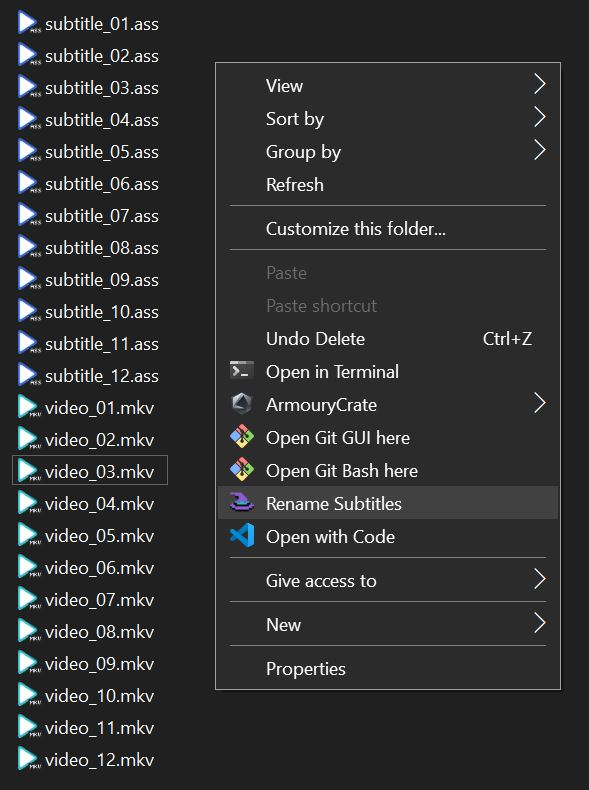

# 一个可批量重命名字幕文件以匹配对应的视频文件的一键工具

A one-click tool that batch-renames subtitles to match their corresponding video filenames



## 逻辑
程序会找到数量匹配的视频文件和字幕文件，并根据其文件名排序，然后将字幕文件更名成对应顺序的视频文件名。

The script identifies videos and subtitles with matching counts, sorts them by their filenames, and renames each subtitle file to match the corresponding video file at the same position.

## 限制
1. 不支持自定义目录，程序须在字幕与视频所在的目录下执行
2. 当前目录下同种格式的视频数量需匹配同种格式的字幕文件数量。比如说当前目录下有10个MKV和5个MP4，则至少要有一种字幕格式是10个或者5个，否则程序不会进行改名

## 安装
### Windows
使用Releases中的SubtitlesRenamer.msi进行安装

### MacOS
于根目录运行
```
git clone https://github.com/dairyfreeZ/batch-subtitles-renamer.git
cd batch-subtitles-renamer
pip install .
```

## 使用
### Windows
于满足要求目录中：右键以打开菜单 -> 选择并点击`Rename Subtitles`

### MacOS
```
cd path/to/subtitles_and_videos_directory
renamer
```

## RYOMT (Release Your Own Magic Tool)
Fetch the repo and navigate to its root dir
```
git clone https://github.com/dairyfreeZ/batch-subtitles-renamer.git
cd batch-subtitles-renamer
```

Make changes and make sure the modified code is buidable
```
bazel build //... && bazel test //...
```

Release the execution file (`pyinstaller` is required), the result of which can be found under `gen/exe/`
```
pyinstaller --onefile --name renamer --icon=resources/icon.ico --paths src --distpath gen/exe main.py 
```

Package the executable to a MSI (`wix` is required), the result of which can be found under `gen/wix/`
```
wix build -out gen\wix\installer.msi wix\Installer.wxs
```